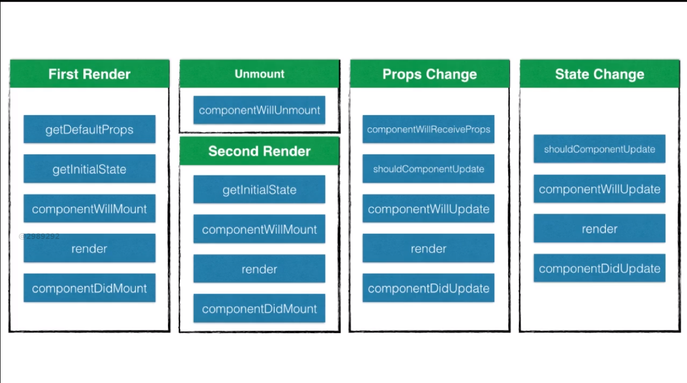

# 操作
`npm  run  start` 运行前端页面

`nodemon server.js`运行后端服务

`mongod --dbpath "D:\mongodb\Server\data" --storageEngine=mmapv1  --journal`运行mongodb数据库

# React介绍



 
[componentWillReceiveProps详解（this.props）状态改变检测机制](https://www.cnblogs.com/gdsblog/p/7348375.html)

具体测试代码
```
import React from 'react'
class App extends React.Component{
  constructor(props){
    super(props)
    this.state={
      '一营老大':'张大喵',
      '骑兵连老大':'红色娘子军',
    }
  }
 changeLeader(){
   this.setState({
      '一营老大':'张大喵2号',
      '骑兵连老大':'红色娘子军2号',
   })
 }
  render(){
    const boss='李云龙'
    return(
      <div>
        <h2>独立团，团长{boss}</h2>
        <一营 老大={this.state.一营老大}></一营>
        <骑兵连 老大={this.state.骑兵连老大}></骑兵连>
        <button onClick={()=>this.changeLeader()}>领导更换</button>
      </div>
    )
  }
}

class  一营 extends React.Component{
  constructor(props){
    super(props)
    this.state={
      solders:['虎子','马根深','柱子']
    }
    console.log("组件初始化")

  }

  componentWillMount(){
    console.log('组件马上就要加载了')
  }

  componentDidMount(){
     console.log('组件加载完毕')
  }
  componentWillReceiveProps(nextProps){
    console.log("组件要接受父组件的值了")
    console.log(this.props)
    console.log(nextProps)
  }
  shouldCompoinentUpdate(){
    console.log("判断是不是要更新组件")
    return true;//记得要返回true
  }
  componentWillUpdate(){
    console.log("马上就要更新组件了")
  }

  componentDidUpdate(){
    console.log("组件更新完毕")
  }

  componentWillUnmount(){
    console.log("组件卸载了")
  }

  addSoulder=()=>{
    console.log('ddd')
    this.setState({
      solders:[...this.state.solders,'新兵蛋子'+Math.random()]
    })
  }

  
  render(){ 
    console.log('组件正在加载')
    return(
      <div>
        <h2>一营，营长{this.props.老大}</h2>
        <button onClick={()=>this.addSoulder()}>新兵入伍</button>
        <ul>
         {this.state.solders.map(function(v){
            return <li key={v}>{v}</li>
         })}
         </ul>
      </div>
    )

    
  }
}

function 骑兵连(props){
  return <h2>骑兵连连长{props.老大},冲啊</h2>
}

export default App
```


# redux
```js
import {createStore} from 'redux'

function counter(){
  switch(action.type){
    case '加机关枪':
      return state+1
    case '减机关枪':
      return state-1
    default:
      retuen 10
  }
}

const store=createStore(counter)
const init=store.getState()
console.log(init)

function listener(){
  const current=store.getState()
  console.log(`现在有机枪${current}把`)
}
store.subscribe(listener)
store.dispatch({type:"加机关枪"})


```


# react-redux
1. `npm install react-redux  --save`
2. 忘记subscribe,只需要记住reducer action dispatch
3. React-redux提供Provider和connect两个接口来链接
4. 多个reducer可以使用combineReducers进行合并

# 使用装饰器优化代码
1. npm install babel-plugin-transform-decorators-legacy --save-dev
2. Error: The ‘decorators’ plugin requires a ‘decoratorsBeforeExport’ option, whose value must be a boolean. If you are migrating from Babylon/Babel 6 or want to use the old decorators proposal, you should use the ‘decorators-legacy’ plugin instead of ‘decorators’.

```
# 1. cnpm install babel-plugin-transform-decorators-legacy  --save-dev
# 2. cnpm install  @babel/plugin-proposal-decorators --save-dev
# 3.1 然后npm run eject  弹出个性化配置
# 3.2 修改babel部分，添加代码
"plugins": [
      ["@babel/plugin-proposal-decorators", { "legacy": true }],
      ["@babel/plugin-proposal-class-properties", { "loose" : true }]
    ]
 
# 4. 如果用的是vscode有提示报错 “experimentalDecorators”
解决办法：
点击Visual Studio Code左下角的配置按钮(或者文件>首选项>配置)，打开用户设置窗口，在搜索框内输入“experimentalDecorators”
"javascript.implicitProjectConfig.experimentalDecorators": false  
// 把false改成true 重启编辑器就可以了
```

```
@connect(
state=>({num:state}),//你要state的什么属性放到props中
{addGUN,removeGUN,addGUNAsync}、、你要什么方法放到props中，自动dispatch
)
```


# react-router4
`npm install react-router-dom --save`
Switch  只渲染命中的第一个Route
this.props.history.push('/')//js进行跳转
<Redirect to="/erying"></Redirect>


# mongodb的安装
参考[mongodb的安装和简单实用以及32-bit servers don't have journaling enabled by default. Please use --journal 错误](https://blog.csdn.net/u010214269/article/details/48024375)


- 加入环境变量
把`MongoDB`加入环境变量 `C:\Program Files\MongoDB\Server\3.2\bin`


- 配置数据库地址以及logs日志地址以及配置服务名"MongoDB"
`mongod --dbpath "D:\mongodb\Server\data"  --logpath "D:\mongodb\Server\logs\logs.txt"  --install -serviceName "MongoDB"  --journal`


- 运行mongodb数据库服务
`mongod --dbpath "D:\mongodb\Server\data" --storageEngine=mmapv1  --journal`
>按照它的指示：“The default storage engine 'wiredTiger' is not available with this build of mongod. Please specify a different storage engine explicitly, e.g. --storageEngine=mmapv1”，换一个storage engine。
必须指定--dbpath "D:\mongodb\Server\data"数据库地址
 

[与MongoDB的第一次亲密接触](https://segmentfault.com/a/1190000002744306)
[安装MongoDB遇到问题](https://blog.csdn.net/gebitan505/article/details/48052273)

Hotfix KB2731284 or later update is not installed(现在已经失效windows不再支持)
[Hotfix KB2731284 or later update is not installed, will zero-out data files](http://www.kriblog.com/bigdata/NoSQL/MongoDb/hotfix-kb2731284-or-later-update-is-not-installed-will-zero-out-data-files.html)
[Steps to download and install Hotfix KB2731284 for mongoDB](http://www.kriblog.com/bigdata/NoSQL/MongoDb/steps-to-download-and-install-hotfix-kb2731284-for-mongodb.html)


# 遇到的坑
1. Missing write access to C:\Users\zhang\AppData\Roaming\npm\node_modules\create-react-app\node_modules\isarray
解决方法：
1）删除原有的node_modules文件夹，即C:\Users\zhang\AppData\Roaming\npm\node_modules
2）重新执行安装命令：npm install -g create-react-app


2. npm does not support node.js v10.15.3
`npm uninstall -g npm`  删除全局模块里面的npm


